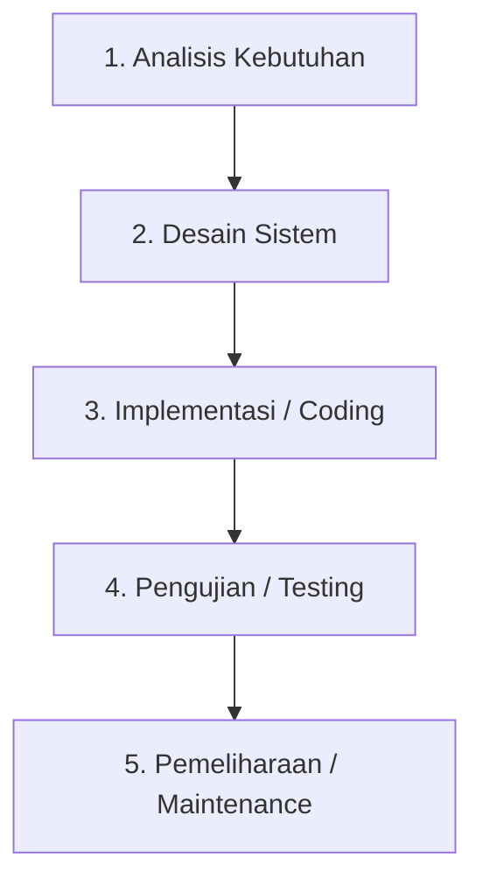
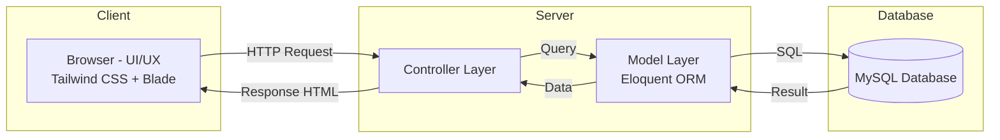

# PERANCANGAN DAN IMPLEMENTASI LEARNING MANAGEMENT SYSTEM DENGAN FITUR MONITORING ORANG TUA PADA SMAN 15 PADANG

**SKRIPSI**

Diajukan Sebagai Salah Satu Syarat Untuk Memperoleh Gelar Sarjana Komputer (Strata 1)

**ADHITYA RAHMAN ARIF**
**NIM. 2201170003**

**PROGRAM STUDI TEKNOLOGI INFORMASI**
**FAKULTAS SAINS DAN TEKNOLOGI**
**UNIVERSITAS PGRI SUMATERA BARAT**
**PADANG 2026**

---

## BAB I — PENDAHULUAN

### 1.1 Latar Belakang

Perkembangan teknologi informasi telah membawa dampak signifikan terhadap transformasi sektor pendidikan di Indonesia. Pergeseran paradigma pembelajaran konvensional menuju pembelajaran berbasis digital menuntut adanya infrastruktur sistem yang mampu mendukung proses belajar mengajar secara efisien, transparan, dan terintegrasi. Dalam konteks ini, *Learning Management System* (LMS) atau Sistem Manajemen Pembelajaran menjadi komponen krusial yang tidak hanya berfungsi sebagai wadah penyimpanan materi, tetapi juga sebagai sarana kolaborasi antara pendidik, peserta didik, dan pemangku kepentingan lainnya. Berbagai studi terdahulu telah membuktikan efektivitas LMS dalam meningkatkan manajemen akademik, seperti yang diimplementasikan pada SMK Wiratama Kotagajah (Caksono et al., n.d.).

Meskipun adopsi teknologi LMS telah meningkat, implementasi yang ada saat ini masih cenderung berfokus pada interaksi internal antara guru dan siswa. Sistem yang dikembangkan sering kali mengabaikan peran vital orang tua sebagai mitra strategis dalam proses pendidikan. Padahal, keberhasilan pendidikan tidak hanya ditentukan oleh aktivitas di dalam kelas, melainkan juga oleh dukungan dan pemantauan yang dilakukan di lingkungan rumah. Sanjaya et al. (2024) dalam penelitiannya menyoroti bahwa sistem monitoring akademik yang efektif harus mampu memberikan akses informasi yang akurat mengenai proses belajar siswa. Namun, pada banyak kasus, informasi tersebut hanya dapat diakses oleh pihak sekolah atau siswa, sehingga menciptakan kesenjangan informasi (*information gap*) bagi orang tua.

Keterbatasan akses informasi ini menjadi masalah fundamental yang perlu diatasi. Orang tua sering kali hanya mengetahui perkembangan akademik anak secara retrospektif, misalnya melalui rapor semesteran, tanpa memiliki kemampuan untuk memantau progres harian atau kesulitan belajar yang dihadapi siswa secara *real-time*. Armansyah & Sekti (2025) menekankan pentingnya fitur interaktif dan pelaporan tugas secara *real-time* untuk meningkatkan keterlibatan siswa, namun fitur tersebut belum secara spesifik dirancang untuk memberikan transparansi kepada orang tua. Tanpa mekanisme monitoring yang terintegrasi, partisipasi orang tua dalam pendidikan cenderung bersifat pasif dan reaktif, yang berpotensi menurunkan motivasi belajar siswa.

Dari sisi teknis, pengembangan LMS yang handal memerlukan pemilihan *framework* yang mumpuni untuk menjamin keamanan data dan skalabilitas sistem. Beberapa penelitian terkini, seperti yang dilakukan oleh Caksono et al. (n.d.), menunjukkan bahwa *framework* Laravel memiliki keunggulan dalam hal keamanan, struktur kode yang terorganisir, dan dukungan komunitas yang luas, sehingga cocok untuk aplikasi berbasis web yang kompleks. Selain itu, aspek *User Interface* (UI) dan *User Experience* (UX) juga menjadi faktor penentu keberhasilan adopsi sistem. Penggunaan *framework* desain modern seperti Tailwind CSS, sebagaimana diadopsi oleh Mardiana et al. (2024), dapat meningkatkan kemudahan penggunaan sistem bagi pengguna dengan tingkat literasi teknologi yang beragam, termasuk orang tua siswa.

SMAN 15 Padang sebagai salah satu satuan pendidikan menengah atas di Kota Padang menghadapi tantangan serupa dalam pengelolaan akademik. Proses administrasi yang masih mengandalkan metode manual, komunikasi antara sekolah dan orang tua yang terbatas pada pertemuan tatap muka periodik, serta belum adanya sistem terpadu untuk mengelola materi pembelajaran, penugasan, dan pencatatan kehadiran menjadi permasalahan utama yang menghambat efisiensi operasional sekolah. Kondisi ini diperkuat oleh meningkatnya tuntutan transparansi akademik dari pihak orang tua yang menginginkan akses informasi perkembangan belajar anak secara *real-time*.

Berdasarkan uraian di atas, terdapat kesenjangan antara kebutuhan akan transparansi akademik bagi orang tua dengan fitur yang tersedia pada LMS umum yang ada saat ini. Penelitian oleh Sanjaya et al. (2024) telah membuka peluang untuk pengembangan sistem monitoring, namun belum secara spesifik mengintegrasikan fitur tersebut ke dalam modul khusus orang tua yang terkoneksi langsung dengan aktivitas siswa. Oleh karena itu, diperlukan sebuah perancangan dan implementasi LMS yang tidak hanya memfasilitasi proses pembelajaran, tetapi juga menyediakan fitur *Parent Monitoring* yang komprehensif.

Penelitian ini bertujuan untuk mengisi kekosongan tersebut dengan merancang sebuah sistem yang memungkinkan orang tua memantau perkembangan akademik, kehadiran, dan tugas siswa secara *real-time* melalui antarmuka yang intuitif. Dengan mengadopsi pendekatan kualitatif dalam analisis kebutuhan, sistem ini diharapkan dapat menjembatani komunikasi antara sekolah dan rumah, sehingga menciptakan ekosistem pendidikan yang lebih kolaboratif. Berdasarkan urgensi tersebut, penulis mengangkat judul **"Perancangan dan Implementasi Learning Management System dengan Fitur Monitoring Orang Tua pada SMAN 15 Padang"** sebagai landasan penelitian ini.

### 1.2 Identifikasi Masalah

Berdasarkan latar belakang yang telah diuraikan, dapat diidentifikasi beberapa permasalahan sebagai berikut:

1. Pengelolaan data akademik seperti materi pembelajaran, penugasan, kehadiran, dan penilaian di SMAN 15 Padang masih dilakukan secara manual dan belum terintegrasi dalam satu sistem terpadu.
2. Belum tersedianya platform digital yang memungkinkan guru untuk mengelola kelas, mata pelajaran, dan siswa secara efisien serta terpusat.
3. Komunikasi antara pihak sekolah dan orang tua mengenai perkembangan akademik siswa masih terbatas pada pertemuan tatap muka dan rapor periodik, sehingga orang tua tidak dapat memantau progres belajar anak secara *real-time*.
4. Sistem informasi yang ada belum mengakomodasi peran orang tua sebagai *stakeholder* penting dalam proses pendidikan melalui fitur monitoring terintegrasi.
5. Belum adanya sistem pelaporan dan analitik yang membantu pihak sekolah dalam mengambil keputusan berbasis data (*data-driven decision making*).

### 1.3 Batasan Masalah

Agar penelitian ini lebih terarah dan fokus, maka ditetapkan batasan masalah sebagai berikut:

1. Sistem yang dikembangkan merupakan aplikasi berbasis web (*web-based application*) menggunakan *framework* Laravel 12 dan Tailwind CSS 4.
2. Ruang lingkup pengguna sistem meliputi lima peran utama: Administrator (*Superadmin/Admin*), Guru (*Teacher*), Siswa (*Student*), Tata Usaha, dan Orang Tua (*Parent*).
3. Fitur utama sistem mencakup manajemen kelas, manajemen mata pelajaran, manajemen pengguna, pengelolaan materi pembelajaran, penugasan, pencatatan kehadiran, penilaian, serta modul monitoring orang tua.
4. Studi kasus penelitian dilakukan di SMAN 15 Padang.
5. Sistem dikembangkan menggunakan metode *Waterfall* dan basis data MySQL.

### 1.4 Rumusan Masalah

Berdasarkan identifikasi dan batasan masalah, rumusan masalah dalam penelitian ini adalah:

1. Bagaimana merancang dan mengimplementasikan Learning Management System yang dapat mengelola proses akademik secara terintegrasi di SMAN 15 Padang?
2. Bagaimana mengembangkan fitur monitoring orang tua yang memungkinkan pemantauan kehadiran, nilai, dan tugas siswa secara *real-time*?
3. Bagaimana merancang sistem dengan arsitektur *multi-role* yang mengakomodasi kebutuhan admin, guru, siswa, tata usaha, dan orang tua dalam satu platform terpadu?

### 1.5 Tujuan Penelitian

Adapun tujuan dari penelitian ini adalah:

1. Merancang dan mengimplementasikan sebuah Learning Management System berbasis web yang mampu mengelola proses akademik secara terintegrasi di SMAN 15 Padang, meliputi manajemen kelas, mata pelajaran, materi, tugas, kehadiran, dan penilaian.
2. Mengembangkan fitur monitoring orang tua (*Parent Monitoring*) yang memungkinkan orang tua memantau perkembangan akademik, kehadiran, dan penugasan siswa secara *real-time*.
3. Membangun sistem dengan arsitektur *multi-role* berbasis *Role-Based Access Control* (RBAC) yang mengakomodasi kebutuhan seluruh pemangku kepentingan dalam satu platform terpadu.

### 1.6 Manfaat Penelitian

#### 1.6.1 Manfaat Teoritis

1. Memberikan kontribusi ilmiah dalam bidang pengembangan sistem informasi pendidikan, khususnya integrasi fitur monitoring orang tua dalam LMS.
2. Menjadi referensi bagi penelitian selanjutnya yang berkaitan dengan pengembangan LMS berbasis web menggunakan *framework* Laravel.
3. Memperkaya literatur mengenai penerapan arsitektur *multi-role* dalam sistem manajemen pembelajaran.

#### 1.6.2 Manfaat Praktis

1. **Bagi Sekolah**: Menyediakan platform terpadu untuk mengelola seluruh proses akademik secara efisien dan mengurangi ketergantungan pada metode manual.
2. **Bagi Guru**: Mempermudah pengelolaan materi, penugasan, kehadiran, dan penilaian siswa melalui antarmuka yang intuitif.
3. **Bagi Siswa**: Memberikan akses mudah terhadap materi pembelajaran, informasi tugas, dan rekap kehadiran serta nilai.
4. **Bagi Orang Tua**: Menyediakan akses monitoring *real-time* terhadap perkembangan akademik anak, sehingga dapat meningkatkan partisipasi aktif dalam proses pendidikan.
5. **Bagi Tata Usaha**: Membantu dalam pengelolaan administrasi data siswa, guru, dan pelaporan akademik.

---

## BAB II — TINJAUAN PUSTAKA

### 2.1 Penelitian Terdahulu

Beberapa penelitian terdahulu yang relevan dengan penelitian ini antara lain:

**1. Caksono, N. D., & Irawan, D. (n.d.). "Rancang Bangun E-Learning SMK Wiratama Kotagajah."**
Penelitian ini membahas perancangan dan pembangunan sistem *e-learning* pada SMK Wiratama Kotagajah menggunakan metode Waterfall. Sistem dikembangkan untuk memfasilitasi proses pembelajaran jarak jauh dengan fitur manajemen materi, tugas, dan ujian online. Hasil penelitian menunjukkan bahwa sistem berhasil meningkatkan efisiensi pengelolaan pembelajaran. Perbedaan dengan penelitian ini terletak pada penambahan fitur monitoring orang tua dan penggunaan *framework* Laravel yang lebih modern.

**2. Sanjaya, M. R., Ruskan, E. L., Putra, B. W., Arrijal, A., & Maula, N. I. (2024). "Pengembangan Sistem Informasi Monitoring Akademik sebagai Media Monitoring Proses Belajar Siswa Menggunakan Metode User Centered Design."**
Penelitian ini mengembangkan sistem informasi monitoring akademik dengan fokus pada penggunaan metode *User Centered Design* (UCD). Sistem dirancang untuk memantau proses belajar siswa secara komprehensif. Perbedaan dengan penelitian ini adalah integrasi fitur monitoring ke dalam LMS yang lengkap dengan manajemen pembelajaran, serta pemanfaatan *framework* Laravel dan Tailwind CSS.

**3. Armansyah, M., & Sekti, A. (2025). "Pengembangan Fitur Pelaporan Tugas Real-Time Pada Sistem E-Learning Berbasis Web Untuk Meningkatkan Interaktivitas Siswa."**
Penelitian ini berfokus pada pengembangan fitur pelaporan tugas secara *real-time* untuk meningkatkan interaktivitas siswa dalam sistem *e-learning*. Hasil penelitian menunjukkan peningkatan keterlibatan siswa melalui fitur pelaporan interaktif. Perbedaan dengan penelitian ini terletak pada cakupan yang lebih luas, mencakup seluruh modul LMS dan integrasi fitur monitoring untuk orang tua.

**4. Mardiana et al. (2024). "Implementasi Framework Tailwind CSS dalam Pengembangan Antarmuka Pengguna Sistem Manajemen Pembelajaran."**
Penelitian ini membahas implementasi *framework* Tailwind CSS dalam pengembangan UI/UX sistem manajemen pembelajaran. Hasil penelitian menunjukkan bahwa Tailwind CSS mampu meningkatkan responsivitas dan estetika antarmuka. Penelitian ini mengadopsi pendekatan serupa dalam pengembangan antarmuka tetapi menambahkan fitur yang lebih komprehensif.

**5. Fathurrahman, M. I., & Kurniawan, R. A. (2023). "Perancangan Sistem Manajemen Pembelajaran Online Berbasis Laravel untuk Sekolah Menengah Atas." *Jurnal Informatika dan Teknologi Pendidikan*, 5(2), 112–124.**
Penelitian ini merancang LMS berbasis Laravel untuk SMA dengan fitur manajemen kelas dan materi. Perbedaannya, penelitian ini mengintegrasikan fitur *parent monitoring* dan menggunakan arsitektur multi-role yang lebih lengkap.

| No | Peneliti | Judul | Metode | Perbedaan |
|----|----------|-------|--------|-----------|
| 1 | Caksono & Irawan (n.d.) | Rancang Bangun E-Learning SMK Wiratama | Waterfall | Belum ada fitur monitoring orang tua |
| 2 | Sanjaya et al. (2024) | Sistem Informasi Monitoring Akademik | UCD | Belum terintegrasi modul LMS lengkap |
| 3 | Armansyah & Sekti (2025) | Pelaporan Tugas Real-Time E-Learning | Pengembangan | Fokus hanya pada tugas, tanpa monitoring orang tua |
| 4 | Mardiana et al. (2024) | Implementasi Tailwind CSS pada LMS | Eksperimental | Fokus pada UI/UX, bukan fitur sistem |
| 5 | Fathurrahman & Kurniawan (2023) | LMS Berbasis Laravel untuk SMA | Waterfall | Belum ada multi-role dan parent monitoring |

### 2.2 Landasan Teori

#### 2.2.1 Learning Management System (LMS)

*Learning Management System* (LMS) adalah perangkat lunak atau platform berbasis web yang dirancang untuk membuat, mendistribusikan, dan mengelola konten pembelajaran secara digital (Ellis, 2009). LMS menyediakan infrastruktur yang memungkinkan pendidik untuk mengunggah materi, membuat tugas, mengelola penilaian, dan memantau progres peserta didik dalam satu platform terpadu.

Menurut Turnbull et al. (2019), fitur utama LMS meliputi: (a) manajemen konten pembelajaran, (b) pengelolaan penugasan dan penilaian, (c) pelacakan progres peserta didik, (d) komunikasi dan kolaborasi, serta (e) pelaporan dan analitik. Dalam konteks pendidikan menengah, LMS berperan penting dalam mendukung proses pembelajaran *blended learning* yang menggabungkan pembelajaran tatap muka dengan pembelajaran daring.

#### 2.2.2 Monitoring Akademik

Monitoring akademik merujuk pada proses pemantauan berkelanjutan terhadap perkembangan belajar peserta didik yang meliputi aspek kehadiran, pencapaian nilai, penyelesaian tugas, dan keterlibatan dalam aktivitas pembelajaran (Sanjaya et al., 2024). Dalam konteks sistem informasi, monitoring akademik dilakukan melalui dashboard terintegrasi yang menyajikan data secara *real-time* sehingga pemangku kepentingan, termasuk orang tua, dapat mengakses informasi terkini mengenai perkembangan akademik siswa.

Keterlibatan orang tua (*parental involvement*) dalam monitoring akademik telah terbukti memiliki korelasi positif dengan peningkatan prestasi belajar siswa (Epstein, 2018). Oleh karena itu, penyediaan akses monitoring bagi orang tua melalui platform digital menjadi aspek krusial dalam pengembangan sistem pendidikan modern.

#### 2.2.3 Framework Laravel

Laravel adalah *framework* PHP *open-source* yang dikembangkan oleh Taylor Otwell dan dirancang untuk memudahkan pengembangan aplikasi web dengan mengikuti pola arsitektur *Model-View-Controller* (MVC) (Otwell, 2024). Laravel menyediakan berbagai fitur bawaan seperti:

1. **Eloquent ORM**: *Object-Relational Mapping* untuk mempermudah interaksi dengan basis data.
2. **Blade Template Engine**: *Template engine* yang memungkinkan pembuatan tampilan dengan sintaks yang bersih dan efisien.
3. **Middleware**: Mekanisme *filtering* HTTP request yang mendukung implementasi autentikasi dan otorisasi berbasis peran.
4. **Artisan CLI**: *Command-line interface* untuk mengotomatisasi tugas-tugas pengembangan.
5. **Migration & Seeder**: Sistem manajemen skema basis data yang *version-controlled*.

Dalam penelitian ini, Laravel versi 12 digunakan sebagai *backend framework* utama dengan PHP versi 8.2 sebagai bahasa pemrograman *server-side*.

#### 2.2.4 Tailwind CSS

Tailwind CSS adalah *utility-first CSS framework* yang menyediakan kelas-kelas utilitas tingkat rendah untuk membangun desain kustom tanpa perlu menulis CSS tradisional (Adam Wathan, 2024). Berbeda dengan *framework* CSS konvensional seperti Bootstrap yang menyediakan komponen siap pakai, Tailwind CSS memberikan fleksibilitas penuh kepada pengembang untuk merancang antarmuka yang unik dan responsif.

Keunggulan Tailwind CSS meliputi: (a) fleksibilitas desain tinggi, (b) ukuran file CSS yang optimal melalui *tree-shaking*, (c) konsistensi desain melalui sistem *design token*, dan (d) kemudahan implementasi *responsive design* dan *dark mode*. Dalam penelitian ini, Tailwind CSS versi 4 digunakan sebagai *framework* CSS utama.

#### 2.2.5 Arsitektur Model-View-Controller (MVC)

*Model-View-Controller* (MVC) adalah pola desain arsitektur perangkat lunak yang memisahkan aplikasi menjadi tiga komponen utama (Gamma et al., 1994):

1. **Model**: Representasi data dan logika bisnis aplikasi. Dalam penelitian ini, Model merepresentasikan entitas seperti User, Teacher, Student, Classroom, Subject, Assignment, Material, Attendance, Grade, dan Submission.
2. **View**: Komponen presentasi yang bertanggung jawab menampilkan data kepada pengguna. Diimplementasikan menggunakan Blade template engine.
3. **Controller**: Komponen yang menangani *request* dari pengguna, memproses logika bisnis melalui Model, dan mengembalikan respons melalui View.

#### 2.2.6 Role-Based Access Control (RBAC)

*Role-Based Access Control* (RBAC) adalah metode pengaturan hak akses sistem berdasarkan peran (*role*) yang dimiliki pengguna (Ferraiolo & Kuhn, 1992). Dalam konteks LMS ini, RBAC diimplementasikan untuk mengatur hak akses lima peran utama:

1. **Admin/Superadmin**: Memiliki akses penuh terhadap seluruh fitur sistem, termasuk manajemen pengguna, kelas, mata pelajaran, analitik, dan pengaturan sistem.
2. **Guru (*Teacher*)**: Mengelola materi, tugas, kehadiran, penilaian, serta fitur wali kelas (*homeroom*).
3. **Siswa (*Student*)**: Mengakses materi, mengerjakan tugas, melihat nilai dan rekap kehadiran.
4. **Tata Usaha**: Mengelola data administrasi siswa dan guru, serta mencetak laporan.
5. **Orang Tua (*Parent*)**: Memantau kehadiran, nilai, dan tugas anak secara *real-time*.

#### 2.2.7 MySQL

MySQL adalah sistem manajemen basis data relasional (*RDBMS*) *open-source* yang menggunakan bahasa *Structured Query Language* (SQL) untuk mengelola data (Oracle Corporation, 2024). MySQL dipilih dalam penelitian ini karena kompatibilitas tinggi dengan *framework* Laravel, performa yang handal untuk aplikasi web skala menengah, serta dukungan komunitas yang luas.

#### 2.2.8 Metode Waterfall

Metode *Waterfall* adalah model pengembangan perangkat lunak yang mengikuti pendekatan sekuensial linier, dimana setiap fase harus diselesaikan sebelum fase berikutnya dimulai (Royce, 1970). Tahapan metode Waterfall meliputi: (1) Analisis Kebutuhan, (2) Desain Sistem, (3) Implementasi, (4) Pengujian, dan (5) Pemeliharaan.

---

## BAB III — METODOLOGI PENELITIAN

### 3.1 Jenis Penelitian

Penelitian ini menggunakan pendekatan **penelitian terapan** (*applied research*) dengan metode pengembangan perangkat lunak *Waterfall*. Penelitian terapan dipilih karena bertujuan untuk menghasilkan produk berupa sistem informasi yang dapat langsung digunakan untuk menyelesaikan permasalahan nyata di SMAN 15 Padang.

### 3.2 Tempat dan Waktu Penelitian

- **Tempat**: SMAN 15 Padang, Kota Padang, Sumatera Barat
- **Waktu**: Februari – Juni 2026

### 3.3 Metode Pengembangan Sistem

Penelitian ini menggunakan metode **Waterfall** yang terdiri dari lima tahapan utama:

#### 3.3.1 Tahap Analisis Kebutuhan

Pada tahap ini dilakukan pengumpulan data dan analisis kebutuhan sistem melalui:

**a. Observasi**
Pengamatan langsung terhadap proses pengelolaan akademik di SMAN 15 Padang, meliputi alur administrasi data siswa, pencatatan kehadiran, distribusi materi, penugasan, dan penilaian.

**b. Wawancara**
Wawancara terstruktur dilakukan dengan *stakeholder* utama:
- Kepala Sekolah: kebutuhan monitoring dan pelaporan
- Guru: kebutuhan pengelolaan pembelajaran
- Staf Tata Usaha: kebutuhan administrasi data
- Orang tua siswa: kebutuhan pemantauan akademik anak
- Siswa: kebutuhan akses materi dan informasi akademik

**c. Studi Literatur**
Kajian pustaka terhadap penelitian terdahulu, dokumentasi *framework* Laravel 12 dan Tailwind CSS 4, serta standar pengembangan sistem informasi pendidikan.

**Hasil Analisis Kebutuhan Fungsional:**

| No | Kebutuhan | Pengguna | Prioritas |
|----|-----------|----------|-----------|
| 1 | Manajemen data siswa (CRUD) | Admin, Tata Usaha | Tinggi |
| 2 | Manajemen data guru (CRUD) | Admin, Tata Usaha | Tinggi |
| 3 | Manajemen kelas dan mata pelajaran | Admin | Tinggi |
| 4 | Manajemen paket pelajaran | Admin | Sedang |
| 5 | Upload dan distribusi materi (PDF, teks, link) | Guru | Tinggi |
| 6 | Pembuatan dan pengelolaan tugas | Guru | Tinggi |
| 7 | Pencatatan kehadiran harian | Guru | Tinggi |
| 8 | Input dan pengelolaan nilai | Guru | Tinggi |
| 9 | Fitur wali kelas (data siswa, catatan, absensi) | Guru (Wali Kelas) | Sedang |
| 10 | Akses materi dan pengumpulan tugas | Siswa | Tinggi |
| 11 | Monitoring kehadiran, nilai, dan tugas anak | Orang Tua | Tinggi |
| 12 | Dashboard analitik dan pelaporan | Admin | Sedang |
| 13 | Pengaturan sistem (umum, akademik, email, backup) | Admin | Sedang |
| 14 | Ekspor data (siswa, kelas, guru) | Admin, Tata Usaha | Sedang |

**Kebutuhan Non-Fungsional:**

| No | Kebutuhan | Deskripsi |
|----|-----------|-----------|
| 1 | Keamanan | Autentikasi login, RBAC, hash password, CSRF protection |
| 2 | Performa | Waktu respons < 3 detik untuk setiap halaman |
| 3 | Responsivitas | Tampilan optimal di desktop, tablet, dan mobile |
| 4 | Usabilitas | Antarmuka intuitif dengan UI modern (glassmorphism, animasi) |
| 5 | Skalabilitas | Mendukung penambahan data dan pengguna |

#### 3.3.2 Tahap Desain Sistem

**a. Perancangan Arsitektur Sistem**

Sistem dirancang menggunakan arsitektur MVC (*Model-View-Controller*) yang diimplementasikan melalui *framework* Laravel 12.

**b. Perancangan Basis Data (ERD)**

Basis data sistem terdiri dari entitas-entitas utama berikut:

| Entitas | Atribut Utama | Relasi |
|---------|---------------|--------|
| **Users** | id, name, email, password, role | One-to-One → Teacher/Student |
| **Teachers** | id, user_id, name, nip, subject_id, phone, address, education, status | BelongsTo → User; HasMany → Attendance |
| **Students** | id, user_id, nis, classroom_id, date_of_birth, address, phone, status | BelongsTo → User, Classroom; HasMany → Attendance, Grade |
| **Classrooms** | id, name, code, description, teacher_id, max_students, status | BelongsTo → User (wali kelas); HasMany → Student; BelongsToMany → Subject |
| **Subjects** | id, name, code, description, category, credit_hours, status | BelongsToMany → Classroom, Package |
| **Materials** | id, subject_id, teacher_id, classroom_id, title, content, file_path, link, status | BelongsTo → Subject, Teacher, Classroom |
| **Assignments** | id, subject_id, teacher_id, classroom_id, title, description, due_date, max_score, status | BelongsTo → Subject, Teacher, Classroom; HasMany → Submission |
| **Submissions** | id, assignment_id, student_id, content, file_path, submitted_at, score, teacher_notes | BelongsTo → Assignment, Student |
| **Attendances** | id, student_id, teacher_id, classroom_id, subject_id, date, status, notes | BelongsTo → Student, Teacher, Classroom, Subject |
| **Grades** | id, student_id, subject_id, classroom_id, score, type, date | BelongsTo → Student, Subject, Classroom |
| **Packages** | id, name, description, status | BelongsToMany → Subject |
| **Settings** | id, key, value, type, group | — |
| **Activity Logs** | id, user_id, action, description, timestamps | BelongsTo → User |
| **Homeroom Notes** | id, classroom_id, teacher_id, content, timestamps | BelongsTo → Classroom |

**c. Perancangan Antarmuka (*User Interface*)**

Desain antarmuka mengutamakan prinsip:
- **Modern & Premium**: Menggunakan *glassmorphism*, gradien dinamis, dan *micro-animations*
- **Responsif**: Layout adaptif untuk berbagai ukuran layar
- **Konsisten**: Sistem desain terintegrasi menggunakan Tailwind CSS 4
- **Aksesibel**: Navigasi intuitif dengan *sidebar* dan *breadcrumb*

#### 3.3.3 Tahap Implementasi

Implementasi sistem dilakukan menggunakan teknologi sebagai berikut:

| Komponen | Teknologi | Versi |
|----------|-----------|-------|
| Bahasa Pemrograman (Backend) | PHP | 8.2 |
| Framework Backend | Laravel | 12 |
| Template Engine | Blade | (bawaan Laravel) |
| Framework CSS | Tailwind CSS | 4.0 |
| Build Tool | Vite | 7.0 |
| Basis Data | MySQL | 8.0 |
| Web Server Lokal | Laragon | — |
| Version Control | Git | — |
| Package Manager (PHP) | Composer | — |
| Package Manager (JS) | NPM | — |

**Struktur Implementasi:**

Sistem diimplementasikan dengan struktur modular mengikuti konvensi Laravel:
- **Models** (15 model): User, Teacher, Student, Classroom, Subject, Material, Assignment, Submission, Attendance, Grade, Package, Setting, SchoolSetting, ActivityLog, HomeroomNote
- **Controllers** (16 controller): Terorganisir dalam namespace Admin, Teacher, Student, dan TataUsaha
- **Views**: Menggunakan Blade template dengan layout komponen reusable
- **Routes**: Dipisahkan berdasarkan peran pengguna (web, admin, teacher, student, tatausaha, dashboards)
- **Migrations** (27 migration): Mencakup seluruh skema basis data

#### 3.3.4 Tahap Pengujian

Pengujian sistem dilakukan menggunakan metode **Black Box Testing**, yang berfokus pada pengujian fungsionalitas sistem tanpa memperhatikan struktur internal kode. Pengujian dilakukan terhadap seluruh modul sistem untuk memastikan bahwa setiap fitur berfungsi sesuai dengan kebutuhan yang telah ditetapkan.

**Rencana Pengujian:**

| No | Modul | Skenario Pengujian |
|----|-------|-------------------|
| 1 | Autentikasi | Login, logout, akses berdasarkan role |
| 2 | Manajemen Kelas | CRUD kelas, assign wali kelas, paket mapel |
| 3 | Manajemen Siswa | CRUD siswa, assign ke kelas |
| 4 | Manajemen Guru | CRUD guru, assign mata pelajaran |
| 5 | Manajemen Mapel | CRUD mata pelajaran, kategori, SKS |
| 6 | Materi Pembelajaran | Upload materi (PDF/teks/link), distribusi ke kelas |
| 7 | Penugasan | Buat tugas, pengumpulan siswa, penilaian |
| 8 | Kehadiran | Input absensi harian, rekap per kelas |
| 9 | Penilaian | Input nilai, rekap per siswa |
| 10 | Wali Kelas | Data siswa perwalian, catatan, rekap |
| 11 | Monitoring Orang Tua | Akses kehadiran, nilai, dan tugas anak |
| 12 | Analitik & Laporan | Dashboard statistik, ekspor data |
| 13 | Pengaturan Sistem | Konfigurasi umum, akademik, backup |

#### 3.3.5 Tahap Pemeliharaan

Tahap pemeliharaan meliputi:
- Perbaikan *bug* yang ditemukan setelah implementasi
- Pembaruan keamanan dan dependensi sistem
- Penambahan fitur berdasarkan umpan balik pengguna
- Backup data secara berkala

### 3.4 Alat dan Bahan Penelitian

#### 3.4.1 Perangkat Keras
- Laptop/PC dengan spesifikasi minimal: Prosesor Intel Core i5, RAM 8 GB, Penyimpanan 256 GB SSD
- Koneksi internet

#### 3.4.2 Perangkat Lunak
- Sistem Operasi: Windows 10/11
- Code Editor: Visual Studio Code
- Web Server: Laragon (Apache + MySQL + PHP)
- Browser: Google Chrome / Mozilla Firefox
- Version Control: Git
- Desain: Figma (untuk wireframe dan mockup)

---

## DAFTAR PUSTAKA

Armansyah, M., & Sekti, A. (2025). Pengembangan Fitur Pelaporan Tugas Real-Time Pada Sistem E-Learning Berbasis Web Untuk Meningkatkan Interaktivitas Siswa. *Bulletin of Computer Science Research*, 6(1), 325–331. https://doi.org/10.47065/bulletincsr.v6i1.891

Caksono, N. D., & Irawan, D. (n.d.). Rancang Bangun E-Learning SMK Wiratama Kotagajah. *Jurnal Ilmu Komputer*, 2(2), 155–161.

Ellis, R. K. (2009). *A Field Guide to Learning Management Systems*. American Society for Training & Development (ASTD).

Epstein, J. L. (2018). *School, Family, and Community Partnerships: Preparing Educators and Improving Schools* (2nd ed.). Routledge.

Fathurrahman, M. I., & Kurniawan, R. A. (2023). Perancangan Sistem Manajemen Pembelajaran Online Berbasis Laravel untuk Sekolah Menengah Atas. *Jurnal Informatika dan Teknologi Pendidikan*, 5(2), 112–124.

Ferraiolo, D. F., & Kuhn, D. R. (1992). Role-Based Access Controls. *Proceedings of the 15th National Computer Security Conference*, 554–563.

Gamma, E., Helm, R., Johnson, R., & Vlissides, J. (1994). *Design Patterns: Elements of Reusable Object-Oriented Software*. Addison-Wesley.

Mardiana et al. (2024). Implementasi Framework Tailwind CSS dalam Pengembangan Antarmuka Pengguna Sistem Manajemen Pembelajaran. *Jurnal Teknologi Informasi dan Komunikasi*, 8(1), 45–58.

Oracle Corporation. (2024). *MySQL 8.0 Reference Manual*. https://dev.mysql.com/doc/refman/8.0/en/

Otwell, T. (2024). *Laravel Documentation*. https://laravel.com/docs/12.x

Royce, W. W. (1970). Managing the Development of Large Software Systems. *Proceedings of IEEE WESCON*, 1–9.

Sanjaya, M. R., Ruskan, E. L., Putra, B. W., Arrijal, A., & Maula, N. I. (2024). Pengembangan Sistem Informasi Monitoring Akademik sebagai Media Monitoring Proses Belajar Siswa Menggunakan Metode User Centered Design. *Jurnal Sistem Informasi*, 13(4), 6490–6503.

Turnbull, D., Chugh, R., & Luck, J. (2019). Learning Management Systems: An Overview. In A. Tatnall (Ed.), *Encyclopedia of Education and Information Technologies*. Springer.

Wathan, A. (2024). *Tailwind CSS Documentation*. https://tailwindcss.com/docs
